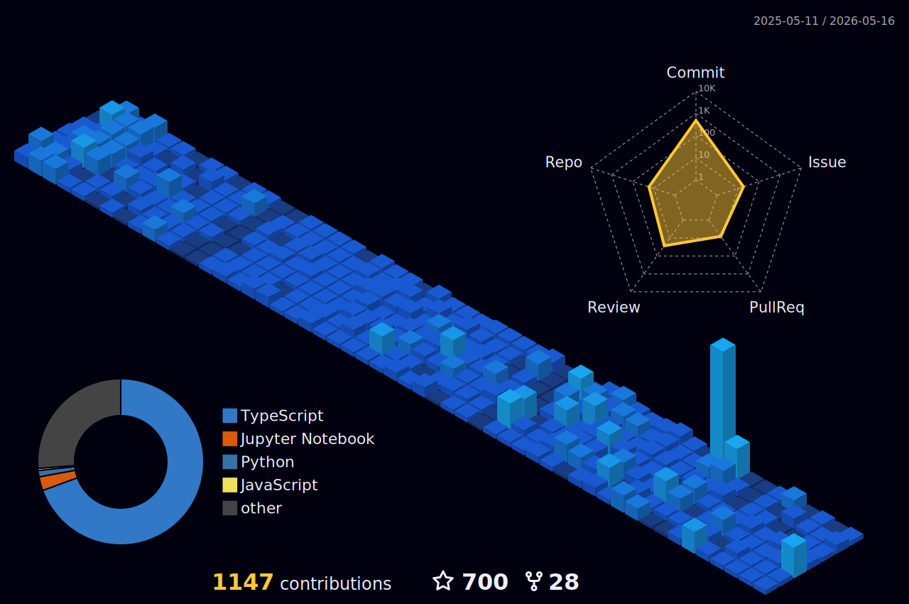

# Mattral

**ML Engineer · Distributed Training · LLM Systems · Computer Vision**

*I build things that work at scale  -- and try to understand why they work at all.*

 

---

## What I actually do

I work in the space between clean research ideas and the messy reality of clusters that fail, data that drifts, and models that need to stay honest in production.

Day-to-day: cloud-scale ML infrastructure at a hyperscaler, distributed training systems, fault-tolerant checkpointing, LLM safety layers, and the occasional low-level kernel when something needs to be faster or more reliable. The majority of that work lives in private repositories. What you see here are the side projects I chose to open-source because they felt worth sharing.

**Things I care about technically**
- Large-scale pre-training infrastructure  -- MoE routing, fault-tolerant checkpointing, tensor/pipeline parallelism
- LLM safety and observability  -- keeping models honest at inference time
- The hardware-software boundary: SIMD, CUDA, kernel-level optimization
- Novel architectures worth *deploying*, not just benchmarking

**Things I care about less technically**
- Code that impresses interviewers but breaks on week two
- Benchmarks that only win on synthetic data
- Documentation that describes the happy path and nothing else

---

## Selected work
> Most of these exist because I needed to solve something concrete.  
> I’d rather have a few things that are real than many that just look good on a profile.

| Project | What it is | Status & Artifacts |
|---------|------------|---------------------|
| **[Composed-MoE-Engine](https://github.com/Mattral/Composed-Mixture-of-Experts-Engine)** | Research-grade runtime for training large Mixture-of-Experts models at hyperscale. Fused Triton Top-K router, composable 4D parallelism (DP + EP + TP + PP), strict forward-pass invariants, elastic fault tolerance, async two-tier checkpointing with automatic expert resharding, chaos testing, and structured telemetry. | Active v2 Preprint (June 2026)  |
| **[KANX](https://github.com/Mattral/KANX)** | Production-grade Kolmogorov-Arnold Networks library with PyTorch + TensorFlow backends, verified ONNX export, Docker + Kubernetes + Helm support, and FastAPI serving. | Active `pip install kanx`   |
| **[production-vlm-engineering](https://github.com/Mattral/production-vlm-engineering)** | Reproducible, production-grade pipelines for modern multimodal vision systems. Efficient VLM adaptation, embedding-space drift detection, edge inference, robustness & safety. | Active Strong production signals across adaptation, monitoring, and deployment |
| **[guardrail-rs](https://github.com/Mattral/guardrail-rs)** | Zero-Python, production-grade LLM security layer written in Rust. Reverse-proxy that blocks prompt injection, redacts PII, and enforces policies with sub-millisecond overhead. Fails open by design, hot-reloadable config, Docker/K8s ready. | Active · v0.3.3 (June 2026) Complements[ GuardRail Studio](https://github.com/Mattral/GuardRail-Studio) |
| **[FlashSpec](https://github.com/Mattral/FlashSpec)** | Adaptive speculative decoding engine with online bandit draft selection and Triton-optimised on-device verification. Preserves target distribution exactly. | Active `pip install flashspec`   |
| **[ReliableAgent](https://github.com/Mattral/ReliableAgent)** | Reliability-first orchestration framework for agentic systems. Plan → execute → critique → replan loop with guardrails at every boundary, full trajectory reconstruction, checkpoint/resume, and quantitative reliability metrics. | Active · v0.2.0 (June 19, 2026) 140 tests · Production-shaped foundations |
| **[RAG-Multimodal-Financial-Doc-Analysis-and-Recall](https://github.com/Mattral/RAG-Multimodal-Financial-Doc-Analysis-and-Recall)** | Production-grade multimodal RAG system for financial documents with hybrid retrieval, VLM chart understanding, numeric grounding, and full observability + CI-gated evaluation. | Active Finance-domain focused |

---

## Stack

Not a comprehensive list. Just what I actually reach for.

**Training & inference** &nbsp;
`PyTorch` `TensorFlow` `Triton` `ONNX` `TensorRT` `FSDP2` `TorchElastic`

**LLM ecosystem** &nbsp;
`Transformers` `PEFT / LoRA` `vLLM` `LangChain` `FastAPI` `Triton Inference Server`

**Distributed & infra** &nbsp;
`NCCL` `Kubernetes` `Helm` `Terraform` `Airflow` `Ray`

**Observability** &nbsp;
`Prometheus` `Grafana` `OpenTelemetry` `Weights & Biases`

**Low-level** &nbsp;
`C++` `AVX2 / SIMD` `CUDA` `pybind11`

**Data** &nbsp;
`PostgreSQL` `Qdrant` `MongoDB` `Spark` `Dask`

---

## A few honest notes

Most of my interesting work happens in private repositories -- production systems at cloud scale where open-sourcing isn't an option. This GitHub is a public window, not the full picture.

That said: the repositories here are written to the same standard I use privately: tests, type checking, CI, real (if limited) benchmarks, and documentation that tries to admit what doesn’t work yet. When something is experimental or incomplete, the README says so.

I’m especially interested in the kinds of failures that only appear at real cluster scale, the practical trade-offs in LLM safety systems, and whether architectures like KANs will eventually find meaningful production use cases.

My path into this work wasn’t linear. I spent time in data engineering and instrumentation before moving deeper into ML systems. That background still shapes how I think about reliability and observability.

---

## Currently

- **Working on:** fixing MoE engine chaos scenario A  -- sudden node failure under expert resharding
- **Reading:** the Megatron-LM codebase and the FlexAttention paper
- **Thinking about:** whether MFU tracking gives you enough signal to catch silent training degradation early

---

## Problem-solving

<table>
  <tr>
    <td align="center">
      
    </td>
  </tr>
</table>

>
> *Algorithms are how I warm up. Systems are where I live.*
>
>

---

## Stats

<table>
  <tr>
    <td>
      
    </td>
    <td>
      
    </td>
  </tr>
</table>

---

## 🎶 Current frequency

---

## Rhythm & motion

  
| | |
|:--:|:--:|
| <video src="https://github.com/user-attachments/assets/0aa09936-7d49-463b-8a9d-7389ad4626c3" width="480" controls loop muted playsinline></video> ||
<!-- https://github.com/user-attachments/assets/0d3282d2-809f-4a47-a5c3-deb43e249453 -->

---

## On the equation that changed everything

$$\mathbf{h}_t = \sigma\!\left(\mathbf{W}_h\,\mathbf{h}_{t-1} + \mathbf{W}_x\,\mathbf{x}_t + \mathbf{b}\right)$$

*The idea that a machine could hold memory across time --*
*that the past could shape the present through nothing more than a weight matrix --*
*was the moment I understood why this field is worth a lifetime.*

*The equation is simple. What it implies is not.*

---

> Outside of work I'm usually reading something I don't fully understand yet,
> listening to music that has no business being that good, and occasionally wondering if the model actually converged or if I just got lucky. I like working with people who say "I don't know" without embarrassment and argue about architecture in good faith.

**[mattralminn@gmail.com](mailto:mattralminn@gmail.com)** 

 

*Open to interesting conversations about distributed training, LLM infrastructure,*
*or any hard ML systems problem worth losing sleep over.*

