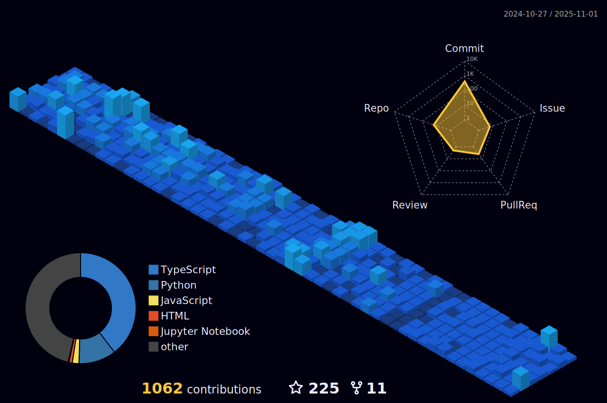

# 🌌 Mattral

**Building systems that see and understand**

*ML Engineer · Computer Vision · NLP · Part-time human being*

 

<table>
  <tr>
    <td>
      
    </td>
    <td>
      
    </td>
  </tr>
</table>

 

---

## ✨ Between the lines

I build machine learning systems that bridge the gap between research and reality.  
Specializing in **computer vision** and **language models**, I care about things that work—and work at scale.

My work lives in two worlds:  
the clean abstractions of mathematics,  
and the messy reality of production systems.

**Current state of affairs:**  
Building proprietary systems by day,  
exploring open questions by night.  
*(GitHub activity is the calm between storms)*

 

**Some truths, in no particular order:**
- Morning ritual: coffee, ambient music, checking if the model converged
- Believe in **elegant systems** over clever hacks
- Forever fascinated by how machines learn to see
- Existential crisis: optional but often included
- Keep my life private, my code public, and my commits clean
- Currently more active in proprietary realms than GitHub's public squares

---

## 🛠 Tools of the trade

*Selected with intention, used with purpose.*

### **Perception & Intelligence**

 

### **Infrastructure & Scale**

 

### **Data & Systems**

 

### **Craftsmanship**

 

---

## 🌐 Connect & context

  

 

---

## 🎶 Current frequency

  

 

---

## 📊 Rhythm & motion

*The quiet work behind the scenes.*

<table>
  <tr>
    <td>
      

    </td>
    <td>
      

    </td>
  </tr>
</table>

 

  

 

 

 

 

---

  
*Where mathematics meets the machine,  
and curiosity meets code.*

 

> *"Most of my interesting work happens in private repositories.  
> Consider this GitHub the quiet cafe where I work on side projects  
> when the proprietary systems are sleeping."*

